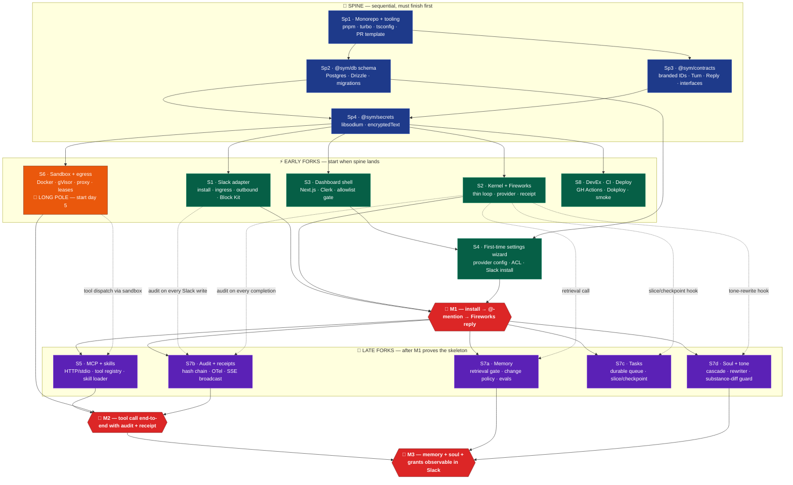

# Sym Build Flow

## Metadata

- Created: 2026-05-23
- Last Edited: 2026-05-23
- Status: **Active · visual companion to the build plan**
- Owner: Sym authors

## Changelog

- 2026-05-23: Initial diagram. Spine → early forks → M1 → late forks →
  M2 → M3, with hidden cross-stream wiring rendered as dotted edges.

---

## Intent

A single diagram you can look at to know what to build next and what
can be built in parallel. Pairs with `implementation-ideology-plan.md`
(detailed flow) and `db-schema-draft.md` (the spine's most-loaded chunk).

---

## The Diagram

---

## How to Read It

- **Vertical = dependency order.** Anything below depends on something
  above. You can't start a node until its solid-arrow predecessors are
  done.
- **Subgraph boxes = parallelism zones.** Everything inside a subgraph
  can be built in parallel by different owners.
- **Dotted arrows = wiring contracts.** The two endpoints don't block
  each other to start, but they share an interface — lock that interface
  in `@sym/contracts` before either side writes code.
- **🎯 milestones are "system is alive" checkpoints.** Don't move past
  one until it actually works end-to-end in Slack.
- **🔴 S6 (sandbox) is the long pole.** Start it the day spine lands
  even though it's not needed until M2 — by the time you "need" it,
  you'd be blocked.

---

## Legend

| Color | Meaning |
|---|---|
| 🟦 Blue (spine) | Sequential foundation; everything depends on these |
| 🟩 Green (early) | Forks the day spine lands; parallel work |
| 🟧 Orange (long pole) | Start early, takes longest, hide behind interfaces |
| 🟪 Purple (late) | Forks after M1 proves the skeleton; parallel work |
| 🟥 Red (milestone) | Observable end-to-end checkpoint; don't move past until live |

---

## What the diagram doesn't show (and why)

- **Calendar.** Nodes ship when they ship; the diagram is dependency
  order, not time. We don't do phases.
- **The cross-unit-impact discipline.** It governs every PR — depicting
  it as edges would clutter the diagram. See
  `.claude/skills/cross-unit-impact/SKILL.md`.
- **Stream internals.** Each Sx node hides 5-10 internal pieces. Those
  are listed in `implementation-ideology-plan.md` under that stream's
  section.
- **Runtime data flow.** This is build order, not request order. A
  runtime diagram (Slack event → Kernel → Tool → Sandbox → Reply →
  Slack) would be a separate document if needed.

---

## Related

- `docs/implementation-ideology-plan.md` — the prose flow this diagram
  visualizes; per-stream internals live there
- `docs/db-schema-draft.md` — the Sp2 review artifact
- `docs/files-to-care-about.md` — blast-radius map of files
- `docs/specs/sym-overview-spec.md` — product + architecture decisions
- `.claude/skills/cross-unit-impact/SKILL.md` — discipline applied on every PR
