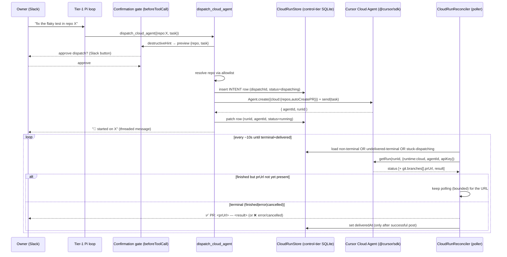

# feat: Cursor Cloud Agent integration

Origin: `docs/specs/2026-06-26-cursor-cloud-agent-integration.md`
Date: 2026-06-26
Type: feat
Depth: Standard (phased delivery)
Reviewed: 2026-06-26 (coherence, feasibility, scope, security, adversarial — applied)

---

## Summary

Add a second execution tier to Sym: alongside the existing conversational Pi
loop, give Sym the ability to **dispatch autonomous coding tasks to Cursor
Cloud Agents** and report the resulting PR back into the Slack thread. Delivered
as a new `@sym/cursor-runtime` workspace package plus thin wiring in `apps/agent`.
**Opt-in** (absent `CURSOR_API_KEY`, nothing changes) and **additive** (the Pi
loop and existing tools are untouched).

---

## Problem Frame

Sym today runs one synchronous conversational tier (Pi loop, Fireworks). Some
owner requests are real coding tasks that want an isolated workspace, a repo,
code search, and shell. Running that inside Sym's container would make the
Slack-facing server an arbitrary-code-execution host holding credentials.

Cursor Cloud Agents solve this: isolated VMs that clone a repo, do the work with
Cursor's toolchain + GitHub integration, and open a merge-ready PR. Sym becomes
the **orchestrator** — it dispatches a cloud agent as a tool call, tracks the run
by polling, and relays the result to Slack. Execution and credentials stay in
Cursor's ephemeral VM.

Two challenges shape the design: (1) the **async lifecycle vs. Sym's
statelessness (I-1)** — a cloud run outlives the turn, but Sym persists no
message state; resolved with a small _control-tier_ run store (I-2) + a poller,
with an **intent row written before dispatch** so a crash can't orphan a run; and
(2) the **task text is a zero-trust boundary** — it is model-generated and may
follow attacker content read during the turn, so dispatch is **confirmation-gated**.

---

## Requirements

Traced to the origin spec.

- **R1** — A `dispatch_cloud_agent({ repo, task, branch? })` tool the
  conversational model can call to launch a Cursor cloud agent.
- **R2** — Dispatch via `@cursor/sdk` cloud mode; model id configurable via
  `CURSOR_MODEL` (default `composer-2.5`).
- **R3** — Target repos resolved against a control-tier **allowlist**; unknown
  repos rejected.
- **R4** — Runs tracked in an unencrypted control-tier SQLite store
  (`cloud_runs`), with a pre-dispatch **intent row** and idempotent delivery
  state. Preserves I-1.
- **R5** — A background reconciler polls `getRun` until terminal
  (`finished`/`error`/`cancelled`) and delivers status + PR/summary into the
  originating thread exactly once.
- **R6** — Opt-in: without a non-empty `CURSOR_API_KEY`, the tool is not
  registered and the reconciler does not start — zero behavior change.
- **R7** — On restart, the reconciler resumes from the store: it re-polls
  non-terminal runs, re-delivers undelivered terminal runs, and resolves
  stuck pre-dispatch intent rows. No run is orphaned or double-delivered.
- **R8** — Dispatch is **confirmation-gated** (`destructiveHint: true`): the
  owner previews the full `repo` + `task` before the run fires. Defends the
  prompt-injection path where task text is attacker-influenced.

Success criteria: an owner can ask Sym to do a coding task on an allowlisted
repo, approve the dispatch preview, see a task message, and receive the PR link
when the cloud agent finishes — exactly once — with the Pi loop and existing
tools unaffected, and CI green (dependency-cruiser DAG, no `console.log` outside
`cli/`, typecheck, vitest).

---

## Key Technical Decisions

- **KTD1 — New package `@sym/cursor-runtime`, scaffolded from `packages/kernel`.**
  `kernel` is the correct template for a _tested_ package: it has a `test` script
  (`vitest run`), a `vitest` catalog devDependency, a `tsconfig.test.json`, and a
  `vitest.config.ts` that includes the test glob. (`mcp-runtime` has none of
  these, so copying it would make `turbo run test` silently skip the package.)
  Package shape (exports, `sideEffects:false`, DAG level) still mirrors the other
  runtime packages. Depends only on `@sym/contracts` + `@cursor/sdk` (+ `zod`
  catalog). `packages/* → apps/*` is a CI error (`.dependency-cruiser.cjs`).
- **KTD2 — Tracking by polling, with the correct SDK surface.** Cursor webhooks
  are REST-only and absent from `@cursor/sdk`'s typed surface (verified). The
  reconciler polls `Agent.getRun(runId, { runtime:'cloud', agentId, apiKey })`
  (verified signature — `runId` positional, `agentId` in options). Terminal
  status set is **`finished | error | cancelled`** (`RunStatus` in the SDK).
  The PR URL is **nested**: `run.git?.branches?.find(b => b.prUrl)?.prUrl`; the
  summary is `run.result`. There are no flat `prUrl`/`summary` fields.
- **KTD3 — `cloud_runs` is control-tier state, not message state.** It stores
  routing data (`dispatchId, runId, agentId, channel, threadTs, status,
deliveredAt, prUrl, statusText`), not conversation content — I-1 holds. Mirrors
  `channel-persona-store.ts` store idioms (unencrypted `node:sqlite`
  `DatabaseSync`, `:memory:` tests, `SYM_CLOUD_DB_PATH` env, `.sym/` default →
  `/data` in prod, `busy_timeout`, no WAL). The `statusText` column stores only
  the short terminal status shown in Slack (e.g. "opened PR #42") — **not** the
  cloud agent's full natural-language summary (that lives in the GitHub PR body).
- **KTD4 — Tier-1 (Pi loop) untouched.** The cloud capability is a new tool +
  boot-time reconciler. No change to `run-turn-loop.ts`, `pi/`, or the model
  path. The Fireworks→other-model swap is out of scope.
- **KTD5 — Cursor default environment; code/PR scope only.** No custom Docker env
  and no `envVars` credential injection in v1. `autoCreatePR: true`,
  `skipReviewerRequest: false` → propose, human reviews/merges. Arbitrary infra
  CLIs (`gcloud`) are out of scope. Note: the SDK does **not** validate the cloud
  model at create time — a bad `CURSOR_MODEL` would otherwise surface mid-`send`;
  `client.ts` validates it via `Cursor.models.list()` at construction for
  fail-fast.
- **KTD6 — Dispatch is confirmation-gated (`destructiveHint: true`).** The
  allowlist bounds the _repo_ dimension only; the _task_ text is model-generated
  and may follow attacker content read earlier in the turn (`fetch_url`,
  `read_channel`). The existing `makeBeforeToolCall` confirmation flow
  (`loop-callbacks.ts` + `confirmations.ts`) already gates lower-risk tools
  (`react_as_owner`, `delete_message`); the higher-blast-radius dispatch must use
  it too. `repo` and `task` are added to the confirmation preview's high-risk
  (never-truncated) fields. Opt-out via `SYM_CLOUD_AGENT_CONFIRM=false` in
  `BehaviorConfig`, mirroring `cliConfirm`, **default on**.
- **KTD7 — Crash-safe lifecycle: intent row + idempotent delivery.** The orphan
  hazard is "dispatch succeeds, persistence doesn't"; the duplicate hazard is
  "deliver, then crash before marking done." Resolved by: (a) insert a
  `dispatching` **intent row** (local `dispatchId`, null `runId`) _before_
  `client.dispatch`, then patch in `runId`/`agentId`; a dispatch that throws marks
  the row `error`; a crash leaves a `dispatching` row the reconciler resolves on
  boot. (b) Deliver to Slack **then** set `deliveredAt`; a post failure leaves the
  row terminal-but-undelivered so the next tick retries; a crash after post-but-
  before-mark re-delivers (bounded, accepted) — preferred over silent loss.
  `deliveredAt` guards the side effect, not just the row.

---

## High-Level Technical Design



Invariant mapping: I-1 preserved (Store holds routing only); I-2 honored
(control-tier state by design); dependency DAG preserved; single-deployable
assumption explicit (see Risks).

---

## Output Structure

```
packages/cursor-runtime/                 @sym/cursor-runtime  (template: packages/kernel)
  package.json            incl. "test": "vitest run" + vitest catalog devDep
  tsconfig.json
  tsconfig.test.json
  vitest.config.ts        include: ['tests/**/*.test.ts']
  src/
    index.ts              barrel (public surface)
    types.ts              CloudDispatchInput, CloudRunRecord, CloudRunStatus + Zod
    client.ts             CursorCloudClient: dispatch() / getRun()
    store.ts              CloudRunStore: SQLite cloud_runs (intent + delivery state)
    reconciler.ts         CloudRunReconciler: interval poller → onTransition
    allowlist.ts          resolveRepo(query, allowlist)
  tests/
    client.test.ts
    store.test.ts
    reconciler.test.ts
    allowlist.test.ts
    types.test.ts
```

---

## Implementation Units

### U1. Scaffold `@sym/cursor-runtime` package (from `packages/kernel`)

**Goal:** Empty, building, test-runnable, workspace-registered package.
**Requirements:** R1 (foundation).
**Dependencies:** none.
**Files:** `packages/cursor-runtime/package.json`,
`packages/cursor-runtime/tsconfig.json`,
`packages/cursor-runtime/tsconfig.test.json`,
`packages/cursor-runtime/vitest.config.ts`,
`packages/cursor-runtime/src/index.ts`; add `@cursor/sdk` (pinned, e.g.
`^1.0.22`) to deps.
**Approach:** Copy the **`packages/kernel`** package shape (it is a tested
package): `"test": "vitest run"`, `devDependencies: { vitest: "catalog:" }`,
`vitest.config.ts` with `include: ['tests/**/*.test.ts']`, `tsconfig.test.json`.
Name `@sym/cursor-runtime`, `private:true`, `type:module`, `sideEffects:false`,
exports `./dist/index.js`. Deps: `@sym/contracts: workspace:*`,
`@cursor/sdk`, `zod: catalog:`. `index.ts` an empty barrel (filled later).
**Patterns to follow:** `packages/kernel/{package.json,vitest.config.ts,
tsconfig.test.json}` (tested-package template); `packages/mcp-runtime/package.json`
for the exports/DAG shape only.
**Test scenarios:** Test expectation: none — scaffolding; verified by
`pnpm -C packages/cursor-runtime build` and a trivial passing test discovered by
`turbo run test`.
**Verification:** Package builds; `@cursor/sdk` links; `turbo run test` discovers
the package (does not skip it); dependency-cruiser clean.

### U2. Types + Zod schemas (`types.ts`)

**Goal:** Package data contracts.
**Requirements:** R1, R2, R4.
**Dependencies:** U1.
**Files:** `packages/cursor-runtime/src/types.ts`,
`packages/cursor-runtime/tests/types.test.ts`.
**Approach:** `CloudRunStatus = 'dispatching' | 'running' | 'finished' | 'error'
| 'cancelled'` (includes the SDK's `cancelled` terminal state and the local
`dispatching` intent state). `CloudDispatchInput { repoQuery, task,
startingRef? }` — note `startingRef` maps to `repos[0].startingRef`, not a
top-level `branch`. `CloudRunRecord { dispatchId, runId?, agentId?, channel,
threadTs, status, statusText?, prUrl?, deliveredAt?, createdAt, updatedAt }`. Zod
schemas for dispatch input and the allowlist config. Keep types package-local
(mirrors `mcp-runtime/config-types.ts`).
**Patterns to follow:** `packages/mcp-runtime/src/config-types.ts`,
`config-parsers.ts`.
**Test scenarios:**

- Happy: valid dispatch input parses; `startingRef` optional.
- Edge: empty/whitespace `task` rejected; missing `repoQuery` rejected.
- Edge: status schema accepts all five states incl. `cancelled` and
  `dispatching`; rejects an unknown string.
  **Verification:** Types compile; schema round-trips a valid record; `cancelled`
  is a valid status.

### U3. `CursorCloudClient` (`client.ts`)

**Goal:** Thin, correct wrapper over `@cursor/sdk` cloud mode.
**Requirements:** R2, R5.
**Dependencies:** U2.
**Files:** `packages/cursor-runtime/src/client.ts`,
`packages/cursor-runtime/tests/client.test.ts`.
**Approach:** `CursorCloudClient` constructed with `{ apiKey, model, sdk? }`
(inject the SDK `Agent`/`Cursor` surface for tests; no network in unit tests). At
construction, validate the model via `Cursor.models.list()` (fail-fast, since
`createCloudAgent` does not validate). Methods:

- `dispatch(input): Promise<{ agentId, runId }>` →
  `Agent.create({ apiKey, model:{id}, cloud:{ repos:[{ url, startingRef }],
autoCreatePR:true, skipReviewerRequest:false } })` then `agent.send(task)`;
  return `{ agentId: agent.agentId, runId: run.id }`.
- `getRun(agentId, runId): Promise<CloudRunView>` →
  `Agent.getRun(runId, { runtime:'cloud', agentId, apiKey })`; map to
  `{ status, prUrl: run.git?.branches?.find(b=>b.prUrl)?.prUrl,
summary: run.result }`. Treat `status==='finished' && !prUrl` as
  `finishedPendingPr` so the reconciler can wait for the URL.
- **Secret hygiene:** implement `toJSON()` returning `'[CursorCloudClient]'`;
  redact the api key from any error message before rethrowing (auth errors may
  embed the key).
- `cancel()` is **not** implemented in v1 (no consumer; the SDK `cancelRun`
  remains available for the future max-age mitigation — see Risks).
  **Patterns to follow:** `apps/agent/src/pi/model.ts` (typed SDK builder);
  DI style across `mcp-runtime`.
  **Test scenarios:**
- Happy: `dispatch` calls `Agent.create` with the configured model + repo (+
  `startingRef` when given) and returns `{agentId, runId}`.
- Happy: `getRun` maps `running` → `running`.
- Happy: `getRun` on a `finished` run extracts `prUrl` from
  `git.branches[].prUrl` and `summary` from `result`.
- Edge: `finished` run with no `prUrl` yet → `finishedPendingPr`.
- Edge: `cancelled` run maps to `cancelled`.
- Error: invalid model id at construction → fail-fast error from
  `Cursor.models.list()` validation.
- Error: SDK auth error message containing the key → rethrown error has the key
  redacted.
- Error: `dispatch` throwing surfaces a typed error, not an unhandled rejection.
  **Verification:** Client tests pass against a fake SDK; PR-url extraction and key
  redaction proven; no real network.

### U4. `CloudRunStore` (`store.ts`)

**Goal:** Unencrypted control-tier SQLite store with intent + delivery state.
**Requirements:** R4, R7.
**Dependencies:** U2.
**Files:** `packages/cursor-runtime/src/store.ts`,
`packages/cursor-runtime/tests/store.test.ts`.
**Approach:** Mirror `channel-persona-store.ts` idioms. Path from
`SYM_CLOUD_DB_PATH` (default `.sym/cloud.db`; `:memory:` in tests), `mkdirSync`
0o700, `busy_timeout`, no WAL. Table `cloud_runs(dispatchId PRIMARY KEY, runId,
agentId, channel, threadTs, status, statusText, prUrl, deliveredAt, createdAt,
updatedAt)`. `dispatchId` (local uuid) is the PK so an intent row exists before a
`runId` is known; `runId` is a nullable column. Methods: `insertIntent(record)`,
`patchDispatched(dispatchId, {runId, agentId})`, `markStatus(dispatchId, status,
patch?)`, `markDelivered(dispatchId)`, `get(dispatchId)`, `getByRunId(runId)`,
`listActive()` returning rows that are non-terminal **or** terminal-but-
undelivered **or** stuck `dispatching`. `statusText` stores only the short Slack
status line, never the full agent summary (KTD3). Duplicate `dispatchId` insert
**rejects** (a duplicate is an internal bug).
**Patterns to follow:** `packages/mcp-runtime/src/channel-persona-store.ts`.
**Test scenarios:**

- Happy: `insertIntent` then `get` returns a `dispatching` row with null `runId`.
- Happy: `patchDispatched` sets `runId`/`agentId` and status `running`.
- Happy: `markStatus(finished, {prUrl})` then `markDelivered` flips `deliveredAt`.
- Edge: `listActive` includes `running`, undelivered `finished`, and stuck
  `dispatching`; excludes delivered terminal rows.
- Edge: duplicate `dispatchId` insert rejects.
- Integration (R7): a new store over the same temp file reads back active rows
  (running, undelivered-terminal, dispatching) for resume.
  **Verification:** Store tests pass on `:memory:`; active rows survive a new store
  instance; delivered terminal rows are excluded from `listActive`.

### U5. `CloudRunReconciler` (`reconciler.ts`)

**Goal:** Interval poller that drives runs to terminal **and delivered**.
**Requirements:** R5, R7.
**Dependencies:** U3, U4.
**Files:** `packages/cursor-runtime/src/reconciler.ts`,
`packages/cursor-runtime/tests/reconciler.test.ts`.
**Approach:** `CloudRunReconciler` constructed with `{ client, store, intervalMs,
onTransition, now?, setIntervalFn?, clearIntervalFn? }` — inject timer/clock seams
so tests advance ticks deterministically (do **not** reference
`mcp-runtime/reconcile.ts`, which is a one-shot function, not a poller). Each
tick loads `store.listActive()` and per row:

- `dispatching` older than a grace window → mark `error` (stuck intent; the
  dispatch never confirmed).
- non-terminal → `client.getRun`; on `finishedPendingPr`, keep polling (bounded
  extra ticks) until `prUrl` appears or a cap, then deliver summary-only.
- terminal (`finished|error|cancelled`) and **not** delivered → call
  `onTransition(record)`; **only if it resolves successfully**, `markDelivered`.
  An `onTransition`/post failure leaves the row undelivered for next-tick retry
  (bounded by max attempts, then log at error).
  Bounded per-tick concurrency. A `client.getRun` throwing for one row logs `warn`
  and does not stop the loop or affect other rows. `console.info/warn/error` only
  (no `console.log`). `start()` picks up existing active rows (R7); `stop()` clears.
  **Patterns to follow:** timer-injection (constructor-passed `setInterval`/
  `clearInterval`); store-mirroring stays in U4.
  **Test scenarios:**
- Happy: `running` → `finished` (with prUrl) fires exactly one `onTransition`,
  then `markDelivered`.
- Happy: a `running` run across ticks fires no transition.
- Edge: `finished` without prUrl waits, then delivers once the URL appears.
- Edge: `cancelled` is treated as terminal and delivered.
- Edge: a stuck `dispatching` row past the grace window is marked `error`.
- Error: `onTransition` throwing leaves the row undelivered → next tick retries
  (no double `markDelivered`, no lost delivery).
- Error: `client.getRun` throwing for one row does not stop the loop.
- Integration (R7): `start()` over a store with a pre-existing undelivered-
  terminal row delivers it without a new dispatch.
  **Verification:** Reconciler tests pass with fake clock + fake client; delivery
  is exactly-once under success and retried under post failure; loop resilient to
  per-run errors.

### U6. Repo allowlist (`allowlist.ts`)

**Goal:** Resolve a repo reference against the configured allowlist.
**Requirements:** R3.
**Dependencies:** U2.
**Files:** `packages/cursor-runtime/src/allowlist.ts`,
`packages/cursor-runtime/tests/allowlist.test.ts`.
**Approach:** `resolveRepo(query, allowlist): RepoRef | null`. Allowlist is a
list of `{ name, url }`. Match by **case-insensitive name** or **exact url**;
return `null` for anything else. No network.
**Patterns to follow:** `packages/mcp-runtime/src/config-parsers.ts`.
**Test scenarios:**

- Happy: known name (any case, e.g. `MyRepo` vs `myrepo`) resolves.
- Happy: known exact URL resolves.
- Edge: unknown name/url returns `null`.
- Edge: empty allowlist returns `null` for any query.
  **Verification:** Allowlist tests pass; unknown repos cannot be dispatched;
  case-insensitive name matching is deterministic.

### U7. Config wiring (`apps/agent/config.ts`)

**Goal:** Surface configuration, opt-in by a **non-empty** `CURSOR_API_KEY`.
**Requirements:** R2, R3, R6.
**Dependencies:** U2, U6.
**Files:** `apps/agent/src/config.ts`, `.env.example`.
**Approach:** Add optional `AgentConfig.cursor?: { apiKey, model,
repoAllowlist, pollIntervalMs, dbPath }`. Derive it with a **trimmed value
check**: `const key = process.env['CURSOR_API_KEY']?.trim(); cursor = key ? {…} :
undefined` — so empty/whitespace keys leave the feature off (R6). `CURSOR_MODEL`
default `composer-2.5`. `repoAllowlist` loaded from the existing `.sym/config.json`
connector-style config (single source of truth, consistent with how MCP
connectors load — no env-var dual source); absent/malformed → empty list (no
crash, matching the MCP posture). Add `SYM_CLOUD_AGENT_CONFIRM` to
`BehaviorConfig` (default true, mirrors `cliConfirm`). **Never log `apiKey`**;
add `.env.example` entries with comments. Live model validation lives in
`client.ts` (KTD5), not here.
**Patterns to follow:** `apps/agent/src/config.ts` (Fireworks block; optional
`slackUserToken` conditional spread; `behaviorEnvSchema`).
**Test scenarios:**

- Happy: non-empty `CURSOR_API_KEY` → `config.cursor` populated, model default
  `composer-2.5`.
- Edge: unset key → `config.cursor` undefined.
- Edge: whitespace-only key → `config.cursor` undefined (feature off).
- Edge: `CURSOR_MODEL` override honored.
- Edge: missing/malformed allowlist → empty list, no crash.
- Edge: `SYM_CLOUD_AGENT_CONFIRM=false` parsed; default true.
  **Verification:** Config tests pass; feature presence keys off a non-empty key;
  allowlist single-sourced; no key in logs.

### U8. `dispatch_cloud_agent` tool (`apps/agent/tools/cloud-agent.ts`)

**Goal:** The confirmation-gated builtin that launches a run.
**Requirements:** R1, R3, R8.
**Dependencies:** U3, U4, U6, U7.
**Files:** `apps/agent/src/tools/cloud-agent.ts`,
`apps/agent/src/tools/registry.ts` (add optional `cursor` to `BuiltinToolDeps`;
**conditionally append** the descriptor + handler inside `createBuiltinDispatcher`
when `deps.cursor` is present — do **not** add to the static
`ALL_BUILTIN_DESCRIPTORS` const), `apps/agent/src/builtin-tools.ts` (doc list),
`apps/agent/src/confirmations.ts` (add `repo`/`task` to high-risk preview keys),
`apps/agent/tests/...`.
**Approach:** Export `DISPATCH_CLOUD_AGENT_DESCRIPTOR` with
`destructiveHint: true` (R8/KTD6) and `readOnlyHint: false`, plus
`handleDispatchCloudAgent`. Handler: validate args (Zod, incl. a `task`
length/character-class sanity check as defense-in-depth), `resolveRepo` (reject
unknown → clear `ToolResult` error, no store write, no dispatch),
`store.insertIntent` (status `dispatching`) **before** dispatch, then
`client.dispatch`, then `store.patchDispatched(runId, agentId)` + status
`running`, post the initial threaded "started" message, return a concise handle.
On `client.dispatch` throwing → `store.markStatus(dispatchId, 'error')` (the
intent row exists) and return a graceful error result. The confirmation gate is
enforced by `destructiveHint` via the existing `makeBeforeToolCall` path (no new
gate logic here). Registration is gated on `deps.cursor` (R6).
**Patterns to follow:** `apps/agent/src/tools/planning.ts` / `web.ts`
(descriptor+handler, `_helpers.argError`); `tools/registry.ts` `BuiltinToolDeps`

- `createBuiltinDispatcher` closure wiring; `slack-write.ts` for
  `destructiveHint` tools; `confirmations.ts` `HIGH_RISK_KEYS`.
  **Test scenarios:**

* Happy: valid args + allowlisted repo → intent row inserted, `client.dispatch`
  called, row patched to `running`, started message posted, success result.
* Error: unknown repo → error result, no intent row, no dispatch.
* Error: empty/oversized/suspicious `task` → `argError`, no dispatch.
* Error: `client.dispatch` throws → intent row marked `error` (not orphaned),
  graceful error result.
* Integration: handler uses injected client/store/slack deps (faked).
* Integration (R6): with `deps.cursor` undefined, the descriptor is absent from
  the dispatcher's `list()` and the handler is absent from its dispatch `Map`
  (assert on the per-instance dispatcher, not the static const).
* Integration (R8): the descriptor carries `destructiveHint: true`.
  **Verification:** Tool tests pass; dispatch path exercised with fakes;
  registration + confirmation gating proven on the dispatcher instance.

### U9. Boot wiring + delivery (`apps/agent` boot + `handle-turn.ts`)

**Goal:** Construct boot singletons, thread them per-turn, deliver results.
**Requirements:** R5, R6, R7.
**Dependencies:** U5, U8.
**Files:** `apps/agent/src/server.ts` (or its boot module),
`apps/agent/src/workspace-context.ts` (or wherever boot deps are assembled),
`apps/agent/src/handle-turn.ts` (the per-turn `createBuiltinDispatcher` assembly
site, ~line 223 — thread the cursor deps into `BuiltinToolDeps`).
**Approach:** When `config.cursor` is set: construct `CursorCloudClient` +
`CloudRunStore` **once at boot** (the store is a persistent `DatabaseSync`
handle; the reconciler is a background `setInterval` — both are singletons),
expose them on the boot/workspace deps, and have `handle-turn.ts` pass
`{ client, store }` as `BuiltinToolDeps.cursor` when assembling the per-turn
dispatcher. Start `new CloudRunReconciler({…}).start()` at boot. `onTransition`
posts a **fresh threaded `chat.postMessage`** ("✅ PR ready: <prUrl> — <status>"
or the error/cancelled message) into the originating thread — it does **not**
drive the live task-card stream (that stream is finalized when the dispatching
turn ended; `task-card-manager` is turn-scoped). Mark delivered only after a
successful post (KTD7). When `config.cursor` is unset: construct nothing, start
no reconciler, thread no cursor deps (R6). On boot the reconciler resumes from
the store (R7). `console.info/warn/error` only; never log the api key.
**Patterns to follow:** `apps/agent/src/server.ts` / `workspace-context.ts`
boot-deps construction; `handle-turn.ts:223` dispatcher assembly;
`apps/agent/src/log.ts` `logCtx`. Slack post via the existing Slack client.
**Test scenarios:**

- Happy: with `config.cursor`, boot constructs client/store + starts reconciler;
  a simulated terminal transition posts a threaded message to the right thread,
  then marks delivered.
- Edge (R6): without `config.cursor`, no reconciler starts, no cursor deps are
  threaded into `BuiltinToolDeps` — asserted at the assembly site.
- Error: a Slack post failure in `onTransition` leaves the row undelivered (next
  tick retries) and does not crash the reconciler.
- Integration (R7): boot over a store with an undelivered-terminal run delivers
  it once without a new dispatch.
  **Verification:** Boot tests pass for on/off states; delivery lands once in the
  correct thread; reconciler resumes on restart; api key never logged.

### U10. End-to-end verification + docs

**Goal:** Prove a real dispatch from Slack and document the feature.
**Requirements:** R1–R8 (acceptance).
**Dependencies:** U9.
**Files:** `packages/cursor-runtime/README.md`, `ARCHITECTURE.md` (add
`@sym/cursor-runtime` to the package table + a cloud-tier note + the single-
deployable assumption), `.env.example` (final values),
`docs/specs/2026-06-26-cursor-cloud-agent-integration.md` (link the plan).
**Approach:** With a real `CURSOR_API_KEY` and one allowlisted repo, trigger
`dispatch_cloud_agent` from Slack; approve the confirmation preview; confirm the
started message, the poll transitions, the `finished`→`prUrl` wait, and the
single final PR message. Verify a forced Slack-post failure retries (not lost),
and a restart mid-run resumes + delivers once. Capture UX gaps and fix. Update
docs to shipped behavior.
**Execution note:** Manual acceptance pass; keep last.
**Test scenarios:** Test expectation: none (manual E2E + docs) — automated
coverage is U2–U9.
**Verification:** A real coding task dispatched from Slack returns a PR link in
the thread exactly once, behind a confirmation preview; ARCHITECTURE + README
updated; CI green.

---

## Scope Boundaries

In scope: the confirmation-gated cloud-dispatch tool, the `@sym/cursor-runtime`
package, poll-based tracking with crash-safe intent rows + idempotent delivery,
control-tier run store, opt-in config, Slack delivery of PR results.

### Deferred to Follow-Up Work

- Webhook receiver for push-based terminal notifications.
- Live intermediate progress on a card (v1 is terminal-only, fresh threaded msg).
- Custom Docker env (`.cursor/environment.json`) + `envVars` creds → `gcloud`/
  infra-ops CLIs in the VM.
- Per-turn cloning of arbitrary (non-allowlisted) repos.
- Run cancellation / max-age leakage policy (uses SDK `cancelRun`; the `client`
  intentionally omits `cancel()` until then).
- Tier-1 model swap off Fireworks (behind the existing `run-turn-loop.ts` seam).

### Non-goals

- Local sandboxing / local execution of shell or repo work (isolation is
  Cursor's VM).
- Auto-merging PRs (always propose + human review).

---

## Risks & Dependencies

- **R-A — `@cursor/sdk` cloud API shape drift.** SDK is young (beta). Mitigation:
  all SDK calls isolated in `client.ts` behind our typed surface, with focused
  tests; the verified shapes (getRun signature, `RunStatus` incl. `cancelled`,
  `git.branches[].prUrl`, `result`) are pinned in U3.
- **R-B — Run leakage / never-terminating runs.** Mitigation: bounded poll
  interval; `dispatching` grace-window resolution; a future max-age + `cancelRun`
  policy (deferred). No hard concurrent-run cap in v1 (single-owner volume is
  low) — revisit if needed.
- **R-C — GitHub integration prerequisite.** Cloud agents need Cursor's GitHub
  connection (account admin). Mitigation: document as setup prerequisite; dispatch
  fails with a clear message if repos are unreachable.
- **R-D — Single-deployable assumption (multi-replica double-delivery).** The
  reconciler assumes **one** agent process over the run store. Sym is "one
  deployable" by design (ARCHITECTURE), so this holds today. Documented here and
  in ARCHITECTURE so a future horizontal scale-out adds a claim/lease column
  before running ≥2 pollers.
- **R-E — Prompt-injection into task text.** The allowlist bounds the repo, not
  the task; task text is model-generated and may follow attacker content read in
  the turn. Mitigated by the `destructiveHint` confirmation gate (R8/KTD6), a
  `task` Zod sanity check, and `autoCreatePR` + human review (no auto-merge).
- **R-F — `CURSOR_API_KEY` exposure.** Full-account, unscoped key. Mitigation:
  trimmed/value-checked, never logged, `client.toJSON()` redaction, key stripped
  from forwarded SDK error messages; stored only in process config, never in the
  unencrypted run store.
- **Dependency:** `@cursor/sdk` added to `@sym/cursor-runtime` (pinned). Verify it
  does not break the audit gate (repo already pins `hono`/`protobufjs`).

---

## Phased Delivery

- **Phase A (U1–U3):** kernel-templated package scaffold + types + client (faked-
  SDK tests; correct getRun/PR-url shapes; key redaction).
- **Phase B (U4–U6):** store (intent + delivery state) + reconciler (idempotent
  delivery, stuck-intent resolution) + allowlist.
- **Phase C (U7–U9):** config (opt-in, trimmed key, single-source allowlist) +
  confirmation-gated tool (conditional registration) + boot wiring (singletons
  threaded through `handle-turn.ts`, fresh-message delivery).
- **Phase D (U10):** real end-to-end dispatch (incl. retry + restart paths) + docs.

Each phase is independently reviewable and leaves the repo green. Phases A–B
touch only the new package; Phase C introduces the opt-in behavior; Phase D
verifies it live.

---

## Sources & Research

- Origin spec: `docs/specs/2026-06-26-cursor-cloud-agent-integration.md`.
- Empirical spikes: `@cursor/sdk@1.0.22` cloud shapes —
  `Agent.getRun(runId, { runtime:'cloud', agentId, apiKey })`,
  `RunStatus = running|finished|error|cancelled`,
  `run.git.branches[].prUrl`, `run.result`, `CloudAgentOptions.repos[].startingRef`,
  no create-time model validation; webhooks REST-only / absent from SDK types.
- Local templates: `packages/kernel/` (tested-package shape),
  `packages/mcp-runtime/src/channel-persona-store.ts` (store idioms),
  `apps/agent/src/tools/{registry,planning,web,slack-write}.ts`,
  `apps/agent/src/{handle-turn,config,confirmations}.ts`,
  `apps/agent/src/pi/loop-callbacks.ts` (confirmation gate).
- Review: coherence, feasibility, scope, security, adversarial (2026-06-26) —
  findings applied (SDK shapes, conditional registration, kernel template,
  intent-row lifecycle, idempotent delivery, confirmation gate, key redaction,
  single-deployable assumption).
- Invariants: `ARCHITECTURE.md` I-1, I-2, I-5, I-6, I-7, dependency DAG.
